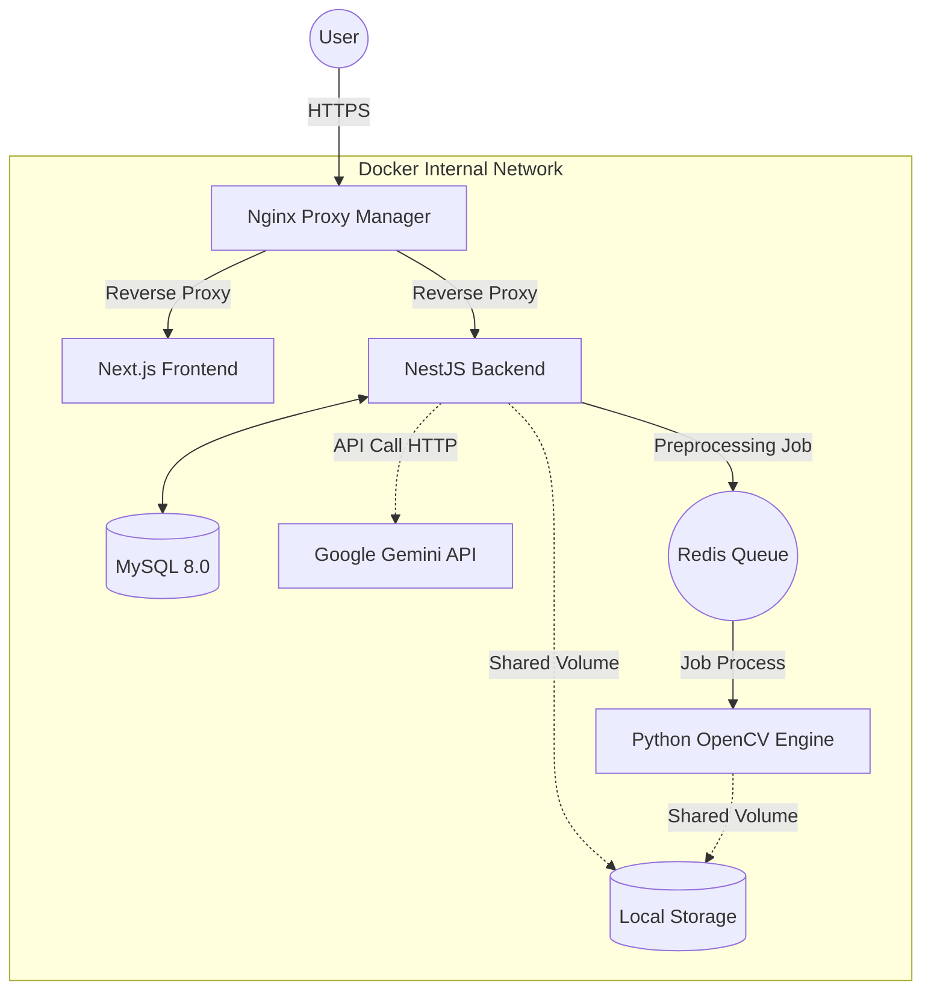

# 🏗️ AI 기반 수기 도면 CAD 자동 변환 플랫폼 (Drawing to CAD)

## 🔗 Live Service
서비스가 현재 운영 중입니다. 아래 링크를 클릭하여 직접 체험해 보세요.

| **Web Dashboard** | **API Documentation** |
| :---: | :---: |
| [**https://quitelog.com**](https://quitelog.com) | [**https://api.quitelog.com/api**](https://api.quitelog.com/api) |

<br/>

> **"아날로그 도면을 디지털의 세상으로."** > 어머니의 반복적인 수기 도면 작업을 자동화하기 위해 개발된 **Generative AI 기반 도면 변환 웹 서비스**입니다.

[]()
[]()
[]()


## 📖 프로젝트 배경 및 진화 (Project Evolution)

### 0. 개발 동기
어머니께서 설계 업무 중 종이에 그려진 도면을 다시 CAD로 옮겨 그리는 단순 반복 작업에 많은 시간을 쏟으시는 것을 보았습니다. 

### 1. 시작: 아날로그의 불편함
어머니께서 종이 도면을 스캔하고, 캐드(CAD) 프로그램 위에서 선을 하나하나 다시 그리는 단순 반복 작업에 많은 시간을 쏟으시는 것을 보았습니다. 이를 자동화하기 위해 프로젝트를 시작했습니다.

### 2. V1: OpenCV 기반 엔진 (Legacy)
초기에는 컴퓨터 비전 기술(OpenCV)을 활용하여 이미지의 경계선(Edge)을 따는 방식을 시도했습니다.
- **방식**: Canny Edge Detection & Adaptive Thresholding 적용.
- **한계**: 도면의 얼룩이나 그림자(노이즈)를 벽체로 오인하거나, 손글씨로 적힌 치수(Text)를 선으로 인식하여 데이터가 훼손되는 문제가 발생했습니다.

### 3. V2: Generative AI 도입 (Current)
단순한 기하학적 계산을 넘어, 도면의 **맥락(Context)**을 이해하기 위해 **Google Gemini 3 Flash**를 도입했습니다.
- **개선점**: AI가 벽체, 창문, 텍스트를 구분하여 인식하므로 노이즈에 강하며, 손글씨 치수까지 디지털 텍스트로 변환이 가능해졌습니다.
- **하이브리드 아키텍처 (Hybrid Pipeline)**:
    - **Python (OpenCV)**: CPU 연산이 필요한 이미지 전처리(노이즈 제거, 이진화)를 전담하여 처리 속도 확보.
    - **NestJS (AI Orchestration)**: 전처리된 이미지를 Gemini API로 전송하고 결과를 파싱하여 DB에 저장.

---

## 🛠 Tech Stack

| Category | Technology | Usage |
| :--- | :--- | :--- |
| **Frontend** | **Next.js , TypeScript** | App Router 기반의 대시보드 및 실시간 미리보기 UI |
| **Backend** | **NestJS** | REST API, Gemini API 연동, BullMQ(큐) 관리, Socket.io |
| **Engine** | **Python 3.11** | OpenCV 기반 이미지 전처리 (노이즈 제거, 이진화) |
| **Database** | **MySQL 8.0** | 사용자 데이터 및 도면 메타데이터 저장 (Drizzle ORM 사용) |
| **Queue** | **Redis** | 백엔드와 파이썬 엔진 간의 비동기 메시지 브로커 |
| **Infra** | **Docker Compose** | 전체 마이크로서비스 오케스트레이션 |
| **Proxy** | **Nginx Proxy Manager** | 리버스 프록시 및 SSL 인증서 관리 (Let's Encrypt) |

---

## 🏗️ 시스템 아키텍처 (Architecture)



## 💡 핵심 엔지니어링 의사결정 (Engineering Decisions)

### 1. 비동기 처리 (NestJS + BullMQ + Redis)
Problem: 고해상도 도면을 AI로 변환하는 데 수십 초가 소요되어, 일반적인 HTTP 요청 시 타임아웃이 발생했습니다.

Solution: 작업을 Redis Queue에 넣고 서버는 즉시 응답(202 Accepted)을 반환합니다. 작업이 완료되면 Socket.io를 통해 클라이언트에게 푸시 알림을 보내 사용자가 기다리지 않게 했습니다.

### 2. Docker Shared Volume 활용
Problem: 백엔드 컨테이너(Node.js)가 업로드한 이미지를 엔진 컨테이너(Python)가 읽어야 하는데, 네트워크로 대용량 파일을 전송하는 것은 비효율적이었습니다.

Solution: 두 컨테이너가 동일한 호스트 경로를 마운트하도록 Shared Volume을 설정하여, 네트워크 오버헤드 없이(Zero-copy) 파일을 공유했습니다.

## 💣 트러블 슈팅 (Troubleshooting Log)
실제 배포 및 개발 과정에서 겪은 치명적인 이슈들과 해결 과정입니다.

### 이슈 1: Docker 환경 변수 우선순위와 DB 접속 거부 (Access Denied)
상황: docker-compose up 배포 시, 백엔드 컨테이너가 MySQL에 접속하지 못하고 ER_ACCESS_DENIED_ERROR를 발생시키며 무한 재시작됨.

원인: MySQL 컨테이너는 최초 생성 시에만 환경 변수(MYSQL_PASSWORD)를 읽어 데이터베이스를 초기화함.

이후 .env 파일의 비밀번호를 변경했지만, Docker Volume에는 여전히 예전 비밀번호로 생성된 데이터가 남아있어 불일치가 발생함.

해결: 개발 초기 단계이므로 docker compose down -v 명령어를 통해 볼륨 데이터를 포함한 모든 리소스를 초기화하여 해결.

docker-compose.yml에서 백엔드 서비스에 주입되는 환경 변수(DB_PASSWORD)를 명시적으로 선언하여, 파일 간 설정 불일치를 방지함.

### 이슈 2: 한글 파일명 인코딩 깨짐 (Encoding Hell)
상황: 사용자가 "평면도_최종.jpg"를 업로드하면 서버 저장소에 시험.jpg와 같이 깨져서 저장됨.

원인: HTTP 통신 시 헤더의 파일명은 기본적으로 Latin1(ISO-8859-1)으로 인코딩되지만, 서버는 이를 UTF-8로 해석하려다 발생한 문제.

해결: Node.js 백엔드에서 Buffer.from(file.originalname, 'latin1').toString('utf8') 처리를 통해 바이너리 데이터를 직접 UTF-8로 재조립하여 해결.

### 이슈 3: 컨테이너 간 "localhost" 통신 단절
상황: 로컬(Host) 개발 환경에선 잘 되던 백엔드가 컨테이너화 후 Redis와 DB를 찾지 못함 (ECONNREFUSED).

원인: 컨테이너 내부에서 localhost는 호스트 PC가 아닌 **컨테이너 자기 자신(loopback)**을 의미함.

해결: Docker Compose가 제공하는 Internal DNS 기능을 활용하여, IP 주소 대신 서비스 이름(db, redis)을 호스트네임으로 사용하도록 설정을 변경.

## 🛡️ 인프라 및 보안 설계 상세
- Zero-Trust Network Architecture
    - Internal Isolation: 데이터베이스(MySQL)와 메시지 브로커(Redis)는 외부 포트 바인딩 없이 Docker Internal Network 내에서만 통신하도록 격리하여, 외부 공격 접점(Attack Surface)을 원천 차단했습니다.

    - Port Minimization: 호스트 머신에서는 오직 HTTP(80)와 HTTPS(443) 포트만 개방하여 보안 위협을 최소화했습니다.

- SSL Offloading & Reverse Proxy
    - Nginx Proxy Manager: 모든 인바운드 트래픽을 Nginx가 먼저 받아 SSL Termination을 수행한 후, 내부 서비스로 라우팅합니다. 이를 통해 백엔드 부하를 줄이고 Let's Encrypt 인증서 갱신을 자동화했습니다.

- Automated CI/CD Pipeline
    - GitHub Actions Workflow:
        - Code Push: 개발자가 Main 브랜치에 코드를 병합.
        - Build & Test: 의존성 설치 및 유닛 테스트 자동 수행.
        - Dockerize: 최적화된 Docker Image 빌드 후 Registry 등록.
        - Deploy: 운영 서버(VPS)에 SSH 접속하여 무중단 배포 스크립트 실행.

- Dynamic Origin Validation
    - CORS & Origin Guard: 백엔드 미들웨어 단계에서 요청의 Origin 헤더를 동적으로 검증하여, 허용되지 않은 클라이언트의 API 접근을 로그 레벨에서 탐지하고 차단합니다.

## 📂 프로젝트 구조 (Project Structure)
```bash
.
├── backend-api/          # NestJS (API, WebSocket, Queue Producer)
│   ├── src/db/           # Drizzle ORM Schema & Config
│   └── src/drawings/     # 도면 처리 비즈니스 로직
├── drawing-engine/       # Python (Consumer, OpenCV, Gemini Client)
├── frontend-web/         # Next.js (Dashboard, UI)
├── npm/                  # Nginx Proxy Manager Data
└── docker-compose.yml    # 인프라 정의서
```

---

## 🚀 핵심 기술 성과 (Key Achievements)

### 1. Python과 NestJS의 장점만 결합한 AI 엔진 최적화
- **문제 해결**: 처음에는 Python 하나로 모든 걸 처리하려니 서버 반응이 느려졌고, NestJS만 쓰자니 이미지 처리가 버거웠습니다.
- **해결 전략**:
    - **Python(OpenCV)**: 힘이 많이 드는 이미지 노이즈 제거와 이진화 작업만 전담시켜 처리 속도를 높였습니다.
    - **NestJS(AI 제어)**: 전처리된 이미지를 받아 **Gemini 3 Flash**와 통신하고, 결과를 DB에 저장하는 역할을 맡겼습니다.
- **성과**: 이 구조를 통해 기존 OpenCV 방식으로는 불가능했던 **손글씨 치수 인식**과 **복잡한 기호 분류**를 성공시켰고, 인식 정확도를 끌어올렸습니다.

### 2. 사용자를 기다리게 하지 않는 '실시간' 경험 구현
- **문제 해결**: 고해상도 도면을 변환하는 데 수십 초가 걸리다 보니, 사용자가 "멈춘 건가?" 하고 새로고침을 누르는 문제가 있었습니다.
- **해결 전략**:
    - 오래 걸리는 작업은 **Redis Queue(BullMQ)**에 넣어 백그라운드에서 처리하게 만들었습니다.
    - 작업이 끝나면 **Socket.io**가 브라우저에 "완료되었습니다!"라고 즉시 알려주도록 구현했습니다.
- **성과**: 사용자는 변환 중에도 대시보드의 다른 기능을 자유롭게 쓸 수 있게 되었고, 불필요한 새로고침(Polling) 트래픽을 없애 **서버 부하를 대폭 줄였습니다.**

### 3. 배포와 보안까지 고려한 자동화 시스템
- **자동화(CI/CD)**: 코드를 수정하고 서버에 올리는 과정이 번거로워, **GitHub Actions**와 **Docker**를 연동했습니다. 이제 코드를 푸시(Push)하기만 하면 테스트부터 배포까지 알아서 진행됩니다.
- **보안(Security)**: DB나 Redis 같은 중요한 데이터 저장소는 외부에서 절대 접근할 수 없도록 **내부망(Internal Network)**에 숨기고, 오직 Nginx를 통해서만 안전하게 접속되도록 설계했습니다.

## 📅 향후 개선 과제 (Roadmap)
- AI 모델 파인튜닝: 도면 데이터셋 학습을 통해 인식 정확도 개선이 필요