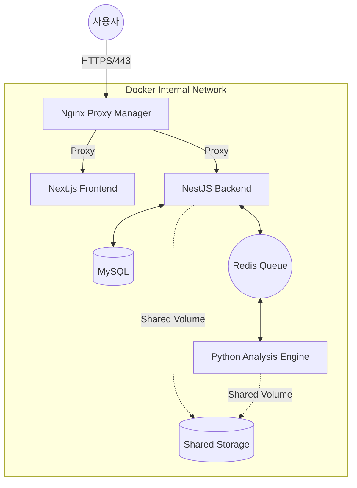
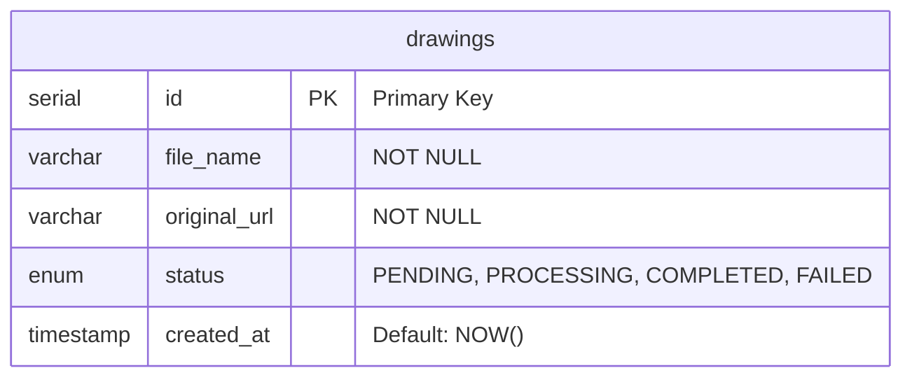

# 🎨 실시간 손도면 캐드 변환 플랫폼 (Drawing to CAD)

어머님의 설계 작업을 돕기 위해 시작된, 수기 도면을 디지털 벡터 데이터로 변환하는 실시간 웹 서비스입니다.

## 🚀 주요 성과 (Key Achievements)

### 1. 실시간 비동기 아키텍처 구축
- **WebSocket (Socket.io)**: Polling 방식을 제거하고 서버 푸시 기술을 도입하여 변환 완료 시 0초 지연 알림 구현.
- **BullMQ & Redis**: NestJS와 Python 엔진 간의 작업 큐를 관리하여 안정적인 분산 처리 환경 구축.

- **Why?**: (BullMQ 도입 이유 추가) 무거운 이미지 처리 작업을 메인 API 서버와 분리하여 처리함으로써, 변환 중에도 사용자가 대시보드의 다른 기능을 끊김 없이 이용할 수 있는 응답성을 확보했습니다.

### 2. 이미지 처리 및 벡터화 엔진 (Python & OpenCV)
- **Adaptive Thresholding**: 조명 및 배경 노이즈(격자 무늬 등)를 효과적으로 제거하는 알고리즘 적용.
- **Buffer-based Encoding**: 웹 환경에서 발생하는 한글 파일명 깨짐 문제를 바이너리 버퍼 변환으로 완벽 해결.

### 3. 사용자 중심 UI/UX
- **Interactive Preview**: 파일 업로드 즉시 브라우저 내 미리보기 제공.
- **Dark Mode Dashboard**: 장시간 작업 시 피로도를 줄이기 위한 다크 테마 및 실시간 상태 스피너 적용.

## 🛠 Tech Stack
- **Frontend**: Next.js, TypeScript, Socket.io-client
- **Backend**: NestJS, Drizzle ORM, BullMQ, Socket.io
- **Engine**: Python, OpenCV, Redis
- **Database**: MySQL (utf8mb4 환경 최적화)
- **Infra**: Docker Compose, Nginx Proxy Manager (SSL)

💡 기술 선택 이유 (Engineering Decision)

Drizzle ORM: Type-safety를 완벽히 보장하면서도, Prisma 대비 가벼운 런타임 성능을 유지하기 위해 선택했습니다.

Shared Volume: 컨테이너 간 대용량 이미지 데이터를 네트워크 전송 비용 없이 효율적으로 공유하기 위해 Docker Volume 전략을 활용했습니다.

## 🏗️ 시스템 아키텍처 (System Architecture)
이 프로젝트는 단일 서버 구조를 넘어, 각 서비스가 컨테이너로 격리된 마이크로서비스 지향 아키텍처로 설계되었습니다.



## 🛡️ 인프라 및 보안 설계 상세 (Infrastructure Deep Dive)
- SSL Termination: Nginx Proxy Manager를 도입하여 Let's Encrypt 기반의 전 구간 HTTPS 암호화 통신을 구현했습니다.

- Port Minimization: 외부 개방 포트를 80(HTTP), 443(HTTPS)으로 단일화하여 공격 접점(Attack Surface)을 최소화했습니다.

- Network Isolation: DB와 Redis를 외부 노출 없이 내부 네트워크에서만 통신하도록 격리하여 인프라 보안을 강화했습니다.

- Health Checks & Monitoring:

    - docker-compose의 healthcheck 기능을 통해 DB 상태를 실시간 모니터링하며, 서비스 간 실행 순서(depends_on)를 제어해 인프라 가동의 안정성을 확보했습니다.

    - 백엔드에 Dynamic Origin Logging 시스템을 구축하여, 허용되지 않은 오리진의 접근 시도를 실시간으로 모니터링하고 보안 디버깅을 수행할 수 있는 환경을 마련했습니다.

## 🎯 주요 이슈 해결 (Troubleshooting Chronicle)
1. 불필요한 네트워크 부하 (Network Optimization)
    
    현상: 도면 변환 확인을 위한 3초 주기 Polling이 서버 자원 및 대역폭 낭비 초래.

    해결: WebSocket(Socket.io)을 도입하여 변환 완료 시점에만 서버가 클라이언트에게 신호를 보내도록 개선.

2. 한글 파일명 깨짐 (Encoding Issue)

    현상: Multer를 통해 전달받은 한글 파일명이 latin1으로 해석되어 깨짐 발생.

    해결: Buffer.from(file.originalname, 'latin1').toString('utf8')을 통해 원본 바이트 데이터를 UTF-8로 재구성하여 해결했습니다.

3. HTTPS 환경에서의 Mixed Content 및 CORS 이슈

    현상: SSL 적용 후 프론트엔드(HTTPS)에서 백엔드(HTTP) 호출 시 보안 정책에 의해 차단됨.

    해결: API 전용 서브도메인을 할당하고, NestJS main.ts에서 Dynamic Origin Whitelist 로직을 구현하여 차단된 오리진을 로그로 추적하고 실시간으로 대응했습니다.

4. 실시간 통신 및 웹소켓 최적화

    현상: 배포 환경에서 Socket.io 연결 시 404 Not Found 및 SSL_PROTOCOL_ERROR 발생.

    해결: Nginx 프록시 설정에서 Websockets Support를 활성화하고, 클라이언트 측 소켓 주소에서 포트 번호를 제거하여 도메인 기반 라우팅으로 통일했습니다.

5. 도커 컨테이너 간 "localhost" 통신 실패

    현상: 컨테이너화 이후 백엔드에서 DB 및 Redis 접속 불가 (ECONNREFUSED).

    원인: 컨테이너 내부에서 localhost는 자기 자신을 가리키며 호스트 PC를 가리키지 않음.

    해결: docker-compose.yml에 정의된 서비스 명(db, redis)을 호스트 네임으로 사용하여 도커 내장 DNS를 통해 통신하도록 수정했습니다.

## 📂 프로젝트 구조 (Project Structure)
```
.
├── backend-api/          # NestJS 기반 API 서버 (BullMQ, Socket.io)
├── frontend-web/         # Next.js 기반 대시보드 (Tailwind CSS)
├── drawing-engine/       # Python 기반 OpenCV 분석 엔진
├── npm/                  # Nginx Proxy Manager 데이터 및 인증서
└── docker-compose.yml    # 전체 서비스 오케스트레이션 설정
```

## 📑 API 명세서 (API Documentation)
백엔드 설계의 일관성을 위해 Swagger를 통한 자동 문서화를 적용했습니다.

(이곳에 Swagger UI 메인 화면 캡처본을 작게 넣어 설계의 깔끔함을 보여주세요)MethodEndpointDescriptionPOST/drawings/upload도면 이미지 업로드 및 변환 작업 큐 등록GET/drawings/:id특정 도면의 변환 상태 및 결과 조회

## 🗄️ 데이터베이스 설계 (Database Design)

데이터의 일관성을 위해 Drizzle ORM을 사용하여 MySQL 스키마를 정의했습니다. 특히 status 컬럼은 Enum 타입을 사용하여 도면 변환의 비동기 작업 상태를 엄격하게 관리하도록 설계했습니다.




### 1. Entity Relationship Diagram (ERD)
- **drawings**: 도면 업로드 정보, 변환 상태, 엔진 처리 결과 및 성능 지표를 통합 관리합니다.

### 2. 주요 스키마 정의 (Schema Definition)
- Strict Status Management: mysqlEnum을 사용하여 PENDING, PROCESSING, COMPLETED, FAILED 4단계 상태를 정의했습니다. 이를 통해 비동기 작업 큐(BullMQ)와 파이썬 엔진 간의 상태 동기화를 엄격하게 통제합니다.

- Data Traceability: original_url 컬럼을 통해 원본 이미지의 저장 위치를 추적하며, 서버 내 물리적 경로 관리의 일관성을 유지합니다.

- Time-series Tracking: createdAt에 defaultNow()를 적용하여 도면 생성 시점을 자동으로 기록, 작업 이력 추적 및 정렬의 기준점으로 활용합니다.

    💡 설계 의도 (Design Choice)

    - Drizzle ORM 활용: SQL과 유사한 선언적 문법을 사용하면서도 TypeScript와의 1:1 타입 매핑을 지원하여, 개발 단계에서의 런타임 에러를 방지하고 타입 안정성을 확보했습니다.

    - 인코딩 최적화: MySQL 8.0 환경에서 utf8mb4 설정을 권장하여 한글 파일명 및 특수문자 처리 시 데이터 깨짐 현상을 방지하도록 설계했습니다.

### 데이터 타입 선택 이유

현재는 도면의 메타데이터 관리에 집중하고 있으며, 향후 추출된 좌표 데이터의 대용량 처리를 위해 JSON 또는 TEXT 타입을 도입하여 가변적인 데이터 크기에 유연하게 대응할 계획입니다.

### 테이블 확장 계획

향후 users 테이블을 추가하여 1:N 관계의 사용자별 도면 이력 관리 기능을 구현하고, 변환 성능 최적화를 위한 process_time 컬럼을 추가하여 모니터링 시스템을 고도화할 예정입니다.

## 🚀 시작하기 (Getting Started)

프로젝트는 **Docker Compose**를 통해 모든 마이크로서비스 인프라를 한 번에 가동할 수 있도록 설계되었습니다.

### 1. 환경 변수 설정
각 서비스 폴더 내의 `.env.example` 파일을 복사하여 실제 환경 변수 파일을 생성합니다.
```bash
# 루트 디렉토리에서 실행
cp backend-api/.env.example backend-api/.env
cp drawing-engine/.env.example drawing-engine/.env
cp frontend-web/.env.example frontend-web/.env.local
```

### 2. 전체 서비스 실행 (Docker)
Docker Compose를 사용하여 DB, Redis, Backend, Engine, Frontend, Nginx Proxy Manager를 한 번에 실행합니다.

```Bash
# 전체 컨테이너 빌드 및 백그라운드 실행
docker-compose up -d --build
```

### 3. 초기 데이터베이스 설정
백엔드 컨테이너가 가동되면 Drizzle ORM을 통해 스키마를 동기화합니다.

```Bash
docker exec -it drawing-service-backend npx drizzle-kit push
```

### 4. 접속 주소 확인
Frontend Dashboard: https://quitelog.com (또는 로컬 http://localhost:3001)

API Swagger: https://api.quitelog.com/api (또는 로컬 http://localhost:3000/api)

Nginx Proxy Admin: http://localhost:81

---

## 📅 향후 개선 과제 (Roadmap)
- AI 고도화: 변환 정확도 향상을 위한 딥러닝 기반 선 검출 모델 통합.

- 편집 도구 확장: 웹상에서 변환된 벡터 데이터를 직접 수정할 수 있는 Canvas 편집 기능 추가.

- CI/CD 자동화: GitHub Actions를 활용한 자동 빌드 및 배포 파이프라인 구축.