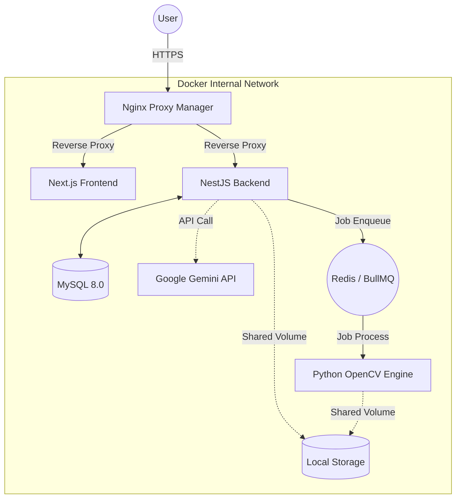

# AI 기반 수기 도면 CAD 자동 변환 프로젝트 (Drawing to CAD)

> 어머니의 반복적인 수기 도면 트레이싱 작업을 자동화하기 위해 시작한 개인 프로젝트입니다.

---

## 📖 프로젝트 배경

어머니께서 종이에 그린 도면을 CAD 프로그램 위에서 선을 하나하나 다시 옮겨 그리는 작업에 많은 시간을 쓰시는 것을 보고, 이를 자동화할 수 있을지 시도해봤습니다.

---

## 🛠 Tech Stack

| Category             | Technology                                            |
| :------------------- | :---------------------------------------------------- |
| **Frontend**         | Next.js · TypeScript                                  |
| **Backend**          | NestJS · TypeScript                                   |
| **AI Engine**        | Google Gemini API                                     |
| **Image Processing** | Python · OpenCV                                       |
| **Database**         | MySQL 8.0 · Drizzle ORM                               |
| **Queue**            | Redis · BullMQ                                        |
| **Infra**            | Docker Compose · Nginx Proxy Manager · GitHub Actions |

---

## 🏗️ 시스템 아키텍처


```mermaid
flowchart TD
    User((User)) -->|HTTPS| NPM[Nginx Proxy Manager]

    subgraph "Docker Internal Network"
        NPM -->|Reverse Proxy| Front[Next.js Frontend]
        NPM -->|Reverse Proxy| Back[NestJS Backend]

        Back <--> DB[(MySQL 8.0)]
        Back -.->|API Call| Gemini[Google Gemini API]
        Back -->|Job Enqueue| Redis((Redis / BullMQ))
        Redis -->|Job Process| Engine[Python OpenCV Engine]

        Back -.->|Shared Volume| Storage[(Local Storage)]
        Engine -.->|Shared Volume| Storage
    end
```

---

## 💡 개발 과정 및 기술적 의사결정

### V1: OpenCV 단독 시도 → 한계 확인

처음에는 Python OpenCV의 Canny Edge Detection과 Adaptive Thresholding으로 도면의 선을 추출하려 했습니다.

결과적으로 노이즈(얼룩, 그림자)와 실제 선을 구분하지 못하고, 손글씨로 적힌 치수를 선으로 인식하는 문제가 반복됐습니다. 수작업 튜닝을 해도 도면마다 조건이 달라서 범용화가 어렵다는 결론을 냈습니다.

<details>
  <summary>📉 V1 실패 결과 보기</summary>
  <br/>
  <div align="center">
    
    
    <p><i>노이즈와 텍스트를 구분하지 못하고 데이터가 훼손된 결과</i></p>
  </div>
</details>

### V2: Gemini API 도입

OpenCV의 한계를 보완하기 위해 Google Gemini API를 도입했습니다. 이미지를 base64로 변환해 Gemini에 전달하고, 도면의 선·원·텍스트 요소를 JSON으로 받아 DXF 파일로 변환하는 방식입니다.

특정 형태의 도면(육각 너트 단면도 등)에서는 선과 원, 치수 텍스트를 어느 정도 인식하는 결과를 얻었습니다.

다만 **범용 도면 변환에는 아직 한계**가 있습니다. 도면의 형태나 복잡도에 따라 인식 결과가 크게 달라지고, 현재 프롬프트는 특정 케이스를 기준으로 작성되어 있습니다. "AI로 도면을 변환한다"는 목표 자체는 가능성을 확인했지만, 프롬프트 엔지니어링과 파인튜닝 없이는 실무 적용이 어렵다는 것을 배웠습니다.

<details>
  <summary>🚀 V2 결과 보기</summary>
  <br/>
  <div align="center">
    
    
    <p><i>특정 도면에서 선·원·치수 텍스트를 인식한 결과</i></p>
  </div>
</details>

### 비동기 처리 구조 설계

변환 작업이 수십 초 걸리다 보니 HTTP 요청이 타임아웃되는 문제가 있었습니다. 작업을 Redis(BullMQ) 큐에 넣고, 완료 시 Socket.io로 클라이언트에 푸시하는 구조를 설계했습니다.

현재 파일 업로드(create) 흐름에서는 이 구조가 동작하고 있으나, 일부 변환 경로는 아직 동기 방식으로 처리되고 있어 리팩토링이 필요한 상태입니다.

### Docker Shared Volume 활용

백엔드(Node.js)가 업로드한 이미지를 Python 엔진이 읽어야 하는 상황에서, 컨테이너 간 네트워크로 파일을 전송하는 대신 Shared Volume을 통해 같은 경로를 마운트하는 방식을 선택했습니다.

---

## 💣 트러블슈팅

### 이슈 1: Docker 환경 변수 우선순위와 DB 접속 거부

**상황**: `docker-compose up` 시 백엔드가 MySQL에 접속하지 못하고 `ER_ACCESS_DENIED_ERROR`로 무한 재시작됨.

**원인**: MySQL 컨테이너는 최초 생성 시에만 환경 변수를 읽어 DB를 초기화합니다. `.env`의 비밀번호를 변경했지만 Docker Volume에는 기존 비밀번호로 생성된 데이터가 남아있어 불일치가 발생했습니다.

**해결**: `docker compose down -v`로 볼륨을 포함해 초기화했습니다. 이후 `docker-compose.yml`에서 백엔드 환경 변수를 명시적으로 선언하여 재발을 방지했습니다.

### 이슈 2: 한글 파일명 인코딩 깨짐

**상황**: "평면도\_최종.jpg"를 업로드하면 서버에 글자가 깨진 파일명으로 저장됨.

**원인**: HTTP 헤더의 파일명은 기본적으로 Latin1(ISO-8859-1)으로 인코딩되는데, 서버가 이를 UTF-8로 해석하려다 발생한 문제입니다.

**해결**: `Buffer.from(file.originalname, 'latin1').toString('utf8')`로 바이너리 데이터를 직접 UTF-8로 재조립해 해결했습니다.

### 이슈 3: 컨테이너 간 localhost 통신 단절

**상황**: 로컬 개발 환경에서는 잘 되던 백엔드가 컨테이너화 후 Redis·DB를 찾지 못함(`ECONNREFUSED`).

**원인**: 컨테이너 내부에서 `localhost`는 호스트 PC가 아닌 컨테이너 자기 자신을 가리킵니다.

**해결**: Docker Compose의 Internal DNS를 활용해 IP 대신 서비스 이름(`db`, `redis`)을 호스트네임으로 사용하도록 변경했습니다.

---

## 🛡️ 인프라 및 보안

- **네트워크 격리**: MySQL·Redis는 외부 포트를 열지 않고 Docker 내부 네트워크로만 통신하도록 격리했습니다. 호스트에서는 80·443 포트만 개방합니다.
- **SSL**: Nginx Proxy Manager로 Let's Encrypt 인증서를 자동 갱신합니다.
- **CI/CD**: GitHub Actions로 main 브랜치 푸시 시 빌드·배포를 자동화했습니다.

---

## 📂 프로젝트 구조

```bash
.
├── backend-api/       # NestJS (API, WebSocket, Queue Producer)
│   ├── src/db/        # Drizzle ORM Schema & Config
│   └── src/drawings/  # 도면 처리 비즈니스 로직
├── drawing-engine/    # Python (Consumer, OpenCV, Gemini Client)
├── frontend-web/      # Next.js (Dashboard, UI)
├── npm/               # Nginx Proxy Manager Data
└── docker-compose.yml
```

---

## 📅 개선 과제

- 다양한 도면 유형에 대한 프롬프트 엔지니어링 개선
- AI 모델 파인튜닝으로 범용 인식률 향상
- BullMQ 비동기 처리를 전체 변환 흐름에 일관성 있게 적용
